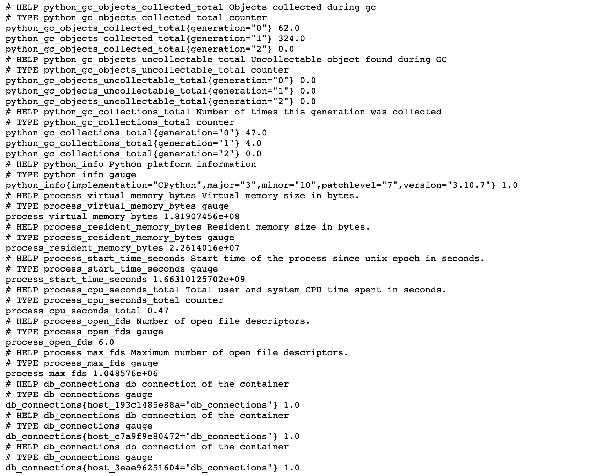

# Custom for MySQL Cluster

## Background
The project is focused on delivering the custom prometheus to capture the active connection for each of in the node in the docker compose replication group.

## How It Works?
- The script is written in `python` connects to mysql cluster and resolves the node address.
- The collector keeps the track of all the nodes in mysql cluster, by resolving node address.
- The collector iterates over all the know hosts in its list and then connect and collects connection metric.
- The script in the end exports these metrics for the prometheus to collect and display.

## How To Bootstrap?
Follow the following instruction:

- Clone this repository,
- Execute `docker-compose up`.
- Hit `localhost:9000` in the browser to view the exporter output.
- Hit `localhost:9090` in the browser to open prometheus and view the output in tabular and graphical representation.

## Outputs

## Screenshots

